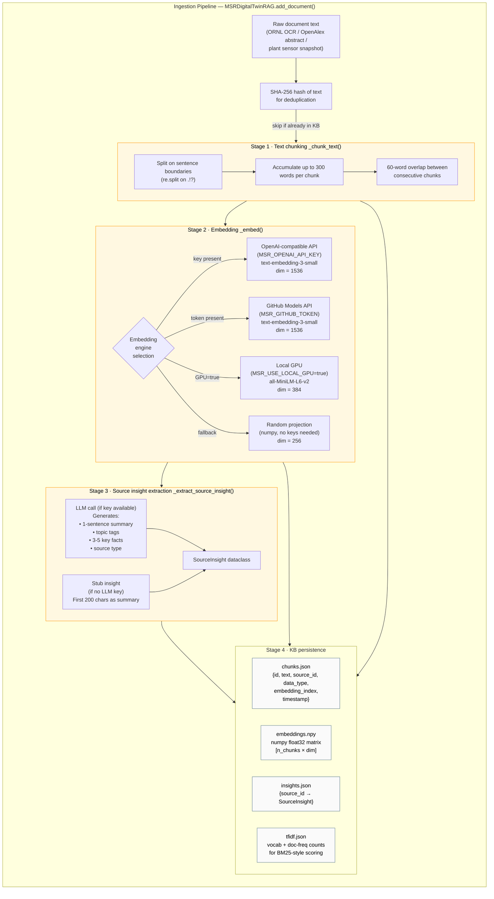
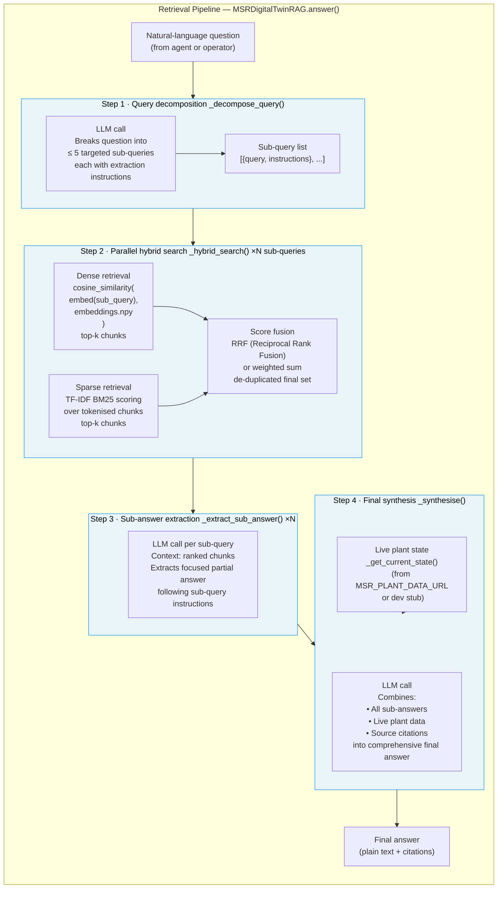
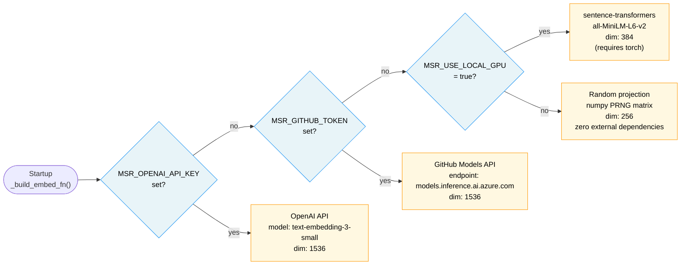

# RAG Pipeline — Internal Architecture

This diagram details the multi-step Retrieval-Augmented Generation pipeline
implemented in `msr_digital_twin_with_rag.py`.

---

## Ingestion Pipeline



---

## Retrieval Pipeline



---

## Embedding engine priority



---

## KB store file layout

```
kb_store/
├── chunks.json          — list of chunk dicts
│                           {id, text, source_id, data_type,
│                            embedding_index, timestamp}
├── embeddings.npy       — float32 numpy array [n_chunks × embed_dim]
├── insights.json        — dict {source_id → {summary, topics, key_facts, source_type}}
├── tfidf.json           — {vocab: {term→idx}, idf: [...], doc_freq: {...}}
├── archive_state.json   — {ingested_files: [...]}
├── openalex_state.json  — {ingested_ids: [...]}
├── arxiv_state.json     — {ingested_ids: [...]}
├── semanticscholar_state.json — {ingested_ids: [...]}
└── plant_data_state.json — {ingested_ids: [...]}
```

All files are regenerated from scratch if missing.  Re-running any loader
only adds genuinely new content — already-seen IDs are skipped.
