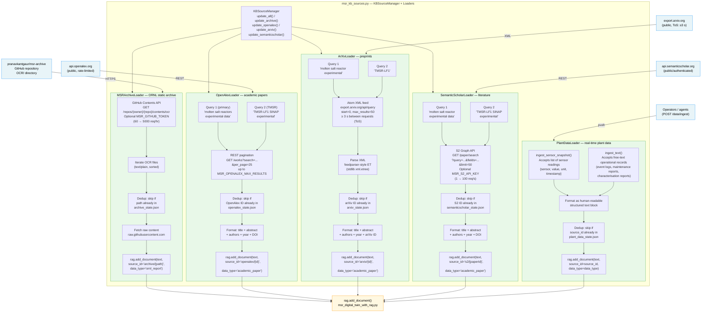
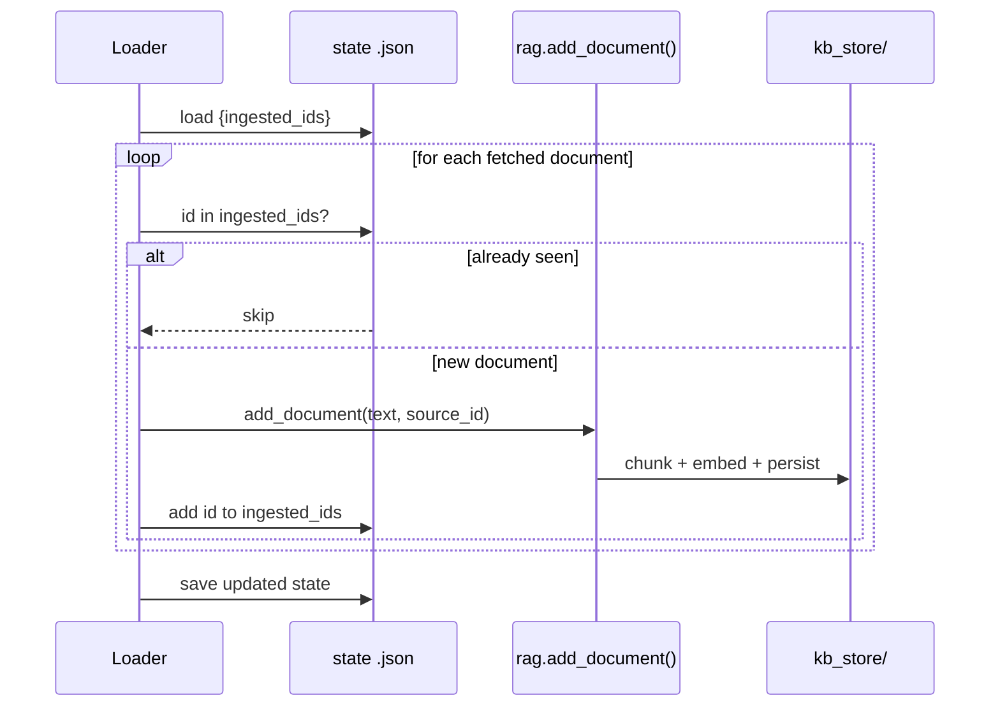

# Knowledge-Base Source Loaders — Architecture

This diagram details the five document-source loaders in `msr_kb_sources.py`
that populate the MSR RAG knowledge base.

---

## Source-loader overview



---

## State-file deduplication

Every loader persists the set of already-ingested document IDs to a JSON
state file so re-running a loader only adds genuinely new content.



---

## CLI reference

```
python msr_kb_sources.py --update-archive
    → MSRArchiveLoader: fetches all new ORNL OCR files

python msr_kb_sources.py --update-openalex
    → OpenAlexLoader: fetches new academic papers

python msr_kb_sources.py --update-arxiv
    → ArXivLoader: fetches new arXiv preprints

python msr_kb_sources.py --update-semanticscholar
    → SemanticScholarLoader: fetches new S2 papers

python msr_kb_sources.py --update-all
    → KBSourceManager.update_all(): runs all four loaders

python msr_kb_sources.py --status
    → prints ingested counts from all state files

python msr_kb_sources.py --ingest-plant-data \
    --content "Core temp 712°C at 14:32" \
    --data-type sensor_snapshot
    → PlantDataLoader: ingests one record from CLI
```

---

## Environment variables

| Variable | Loader | Purpose |
|---|---|---|
| `MSR_GITHUB_TOKEN` | `MSRArchiveLoader` | GitHub API token (60 → 5000 req/hr) |
| `MSR_ARCHIVE_REPO` | `MSRArchiveLoader` | `owner/repo` (default `pranavkantgaur/msr-archive`) |
| `MSR_ARCHIVE_BRANCH` | `MSRArchiveLoader` | Branch to fetch (default `master`) |
| `MSR_ARCHIVE_MAX_DOCS` | `MSRArchiveLoader` | Max files per run (0 = unlimited) |
| `MSR_OPENALEX_MAX_RESULTS` | `OpenAlexLoader` | Max papers per run (default 100) |
| `MSR_OPENALEX_EMAIL` | `OpenAlexLoader` | Polite-pool header for better rate limits |
| `MSR_ARXIV_MAX_RESULTS` | `ArXivLoader` | Max papers per run (default 100) |
| `MSR_S2_API_KEY` | `SemanticScholarLoader` | API key (1 → 100 req/s) |
| `MSR_S2_MAX_RESULTS` | `SemanticScholarLoader` | Max papers per run (default 100) |
| `MSR_KB_DIR` | all loaders | KB store directory (default `./kb_store`) |
