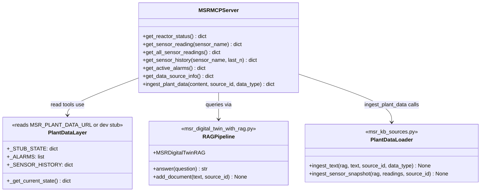
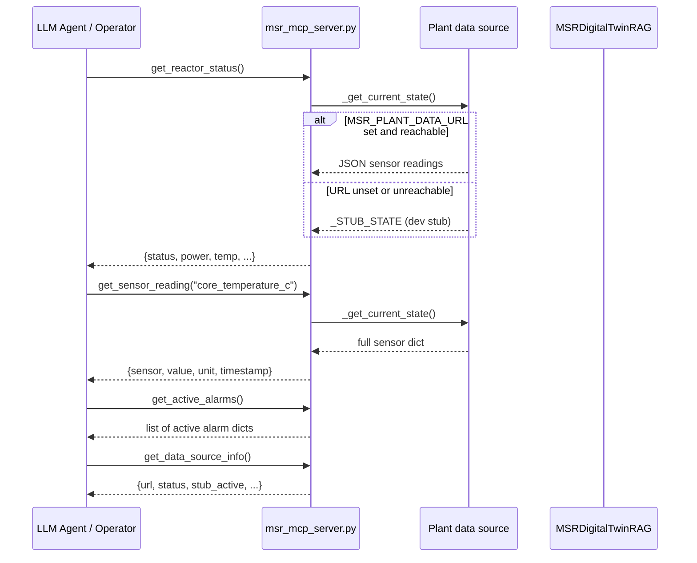
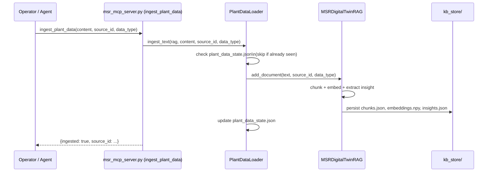
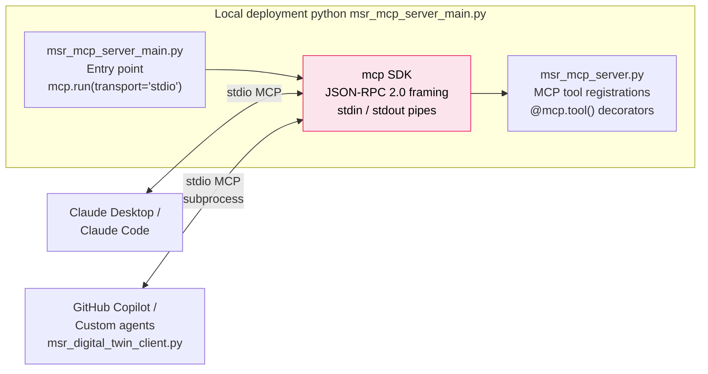
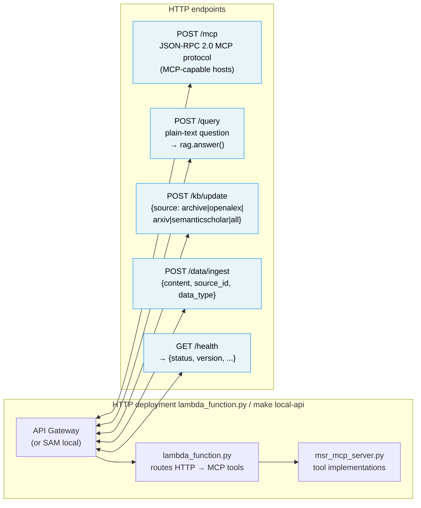

# MCP Server — Tool Surface & Transport Variants

This diagram details the Model Context Protocol (MCP) server implemented
in `msr_mcp_server.py` and the two transport variants that expose it.

---

## MCP tool surface

---

## Read-tool data flow

---

## Write-tool (ingest) data flow

---

## stdio transport (local / Claude Desktop)

The `msr_digital_twin_client.py` `MSRDataLayerClient` spawns
`msr_mcp_server_main.py` as a child process and communicates over its
`stdin`/`stdout` — no network port needed.

---

## HTTP transport (Lambda / local-api)

---

## Sensor stubs (development mode)

When `MSR_PLANT_DATA_URL` is not set, the server uses a built-in stub with
representative TMSR-LF1/MSRE-class FLiBe reactor parameters:

| Sensor | Stub value | Unit |
|---|---|---|
| `reactor_power_mw` | 100.0 | MW |
| `core_temperature_c` | 700.0 | °C |
| `salt_flow_rate_kg_s` | 250.0 | kg/s |
| `fuel_salt_level_pct` | 87.5 | % |
| `coolant_salt_level_pct` | 91.2 | % |
| `neutron_flux_n_cm2_s` | 2.5 × 10¹³ | n/cm²/s |
| `primary_loop_pressure_bar` | 1.1 | bar |
| `heat_exchanger_outlet_c` | 565.0 | °C |
| `turbine_inlet_temp_c` | 540.0 | °C |
| `turbine_output_mwe` | 42.0 | MWe |
| `tritium_production_rate_g_day` | 0.12 | g/day |
| `off_gas_activity_bq_m3` | 3.8 × 10⁶ | Bq/m³ |
