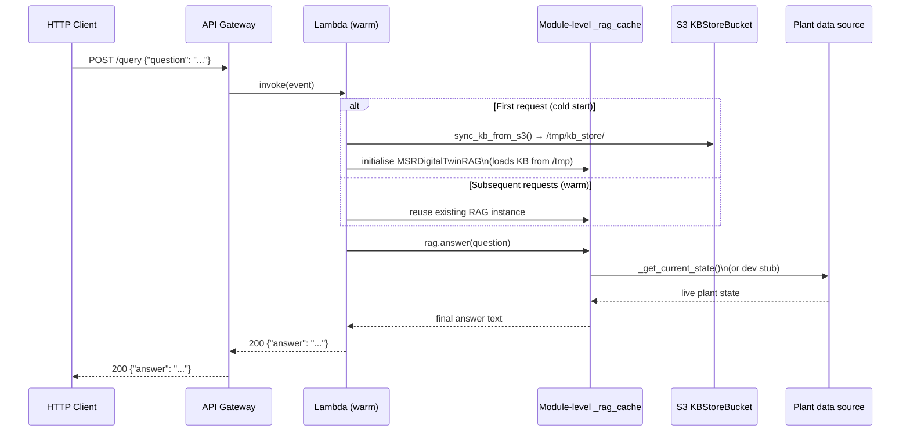
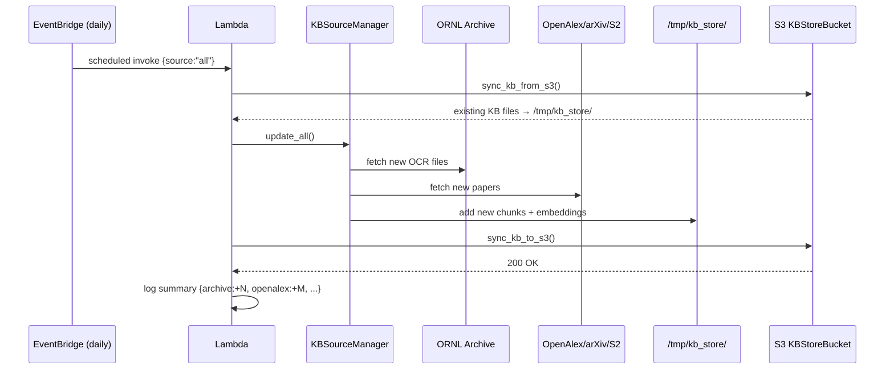
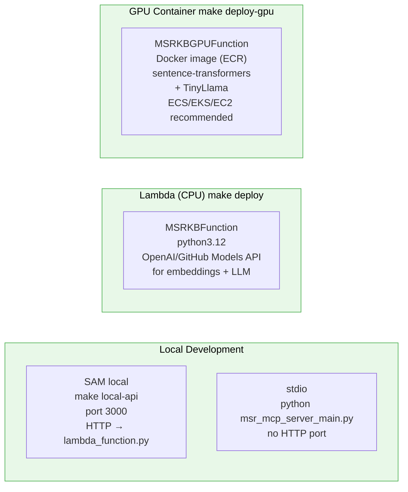

# AWS Lambda Deployment Architecture

This diagram details the serverless deployment of the MSR Data Layer on AWS,
defined in `template.yaml` and built/deployed via `Makefile`.

---

## Resource topology

```mermaid
flowchart TD
    subgraph AWS["AWS Account — CloudFormation stack: msr-kb-service"]

        subgraph APILAYER["API Layer"]
            APIGW["API Gateway — MSRHttpApi\nHTTP API v2\nCORS: AllowOrigins *\nStage: {Environment}"]
        end

        subgraph COMPUTE["Compute"]
            FUNC["Lambda — MSRKBFunction\npython3.12 / x86_64\nMemory: 1 024 MB\nTimeout: 900 s (15 min)\nX-Ray tracing: Active\nReserved concurrency: none\n(scales to Lambda default)"]
            GFUNC["Lambda — MSRKBGPUFunction\n(optional, Condition: DeployGPUFunction)\nContainer image from ECR\nsentence-transformers + TinyLlama\nECS/EKS/EC2 recommended\nfor GPU workloads"]
        end

        subgraph STORAGE["Storage"]
            S3["S3 — KBStoreBucket\nmsr-kb-store-{AccountId}-{Environment}\nVersioning: Enabled\nEncryption: AES-256\nPublic access: blocked\nOld-version expiry: 30 days\nStores:\n  chunks.json\n  embeddings.npy\n  insights.json\n  tfidf.json\n  *_state.json files"]
        end

        subgraph EVENTS["Event Sources"]
            EB["EventBridge Rule\nSchedule: rate(1 day)\n(configurable KBUpdateSchedule)\n→ invokes FUNC with\n  {source: 'all'}"]
        end

        subgraph SECURITY["Security"]
            IAM["IAM Role — MSRKBFunctionRole\nManaged: AWSLambdaBasicExecutionRole\nInline: s3:GetObject + s3:PutObject\n  on KBStoreBucket/*\nInline: xray:PutTelemetryRecords\n  xray:PutTraceSegments"]
        end

        subgraph OBS["Observability"]
            CW["CloudWatch\nLog group: /aws/lambda/MSRKBFunction\nRetention: 7 days\nX-Ray service map\n+ traces per request"]
        end

        APIGW -->|ALL /{proxy+}| FUNC
        FUNC  <-->|sync_kb_from_s3()\nsync_kb_to_s3()| S3
        EB    -->|scheduled\nEventBridge invoke| FUNC
        FUNC  --> CW
        IAM   -.->|grants| FUNC
        FUNC  -.->|optionally invokes| GFUNC
    end

    %% External callers
    EXT["External consumers\n(agents, operators)\nHTTP/HTTPS"]
    EXT <-->|HTTPS| APIGW

    classDef aws   fill:#fff3e0,stroke:#ff9800,color:#000
    classDef sec   fill:#fce4ec,stroke:#e91e63,color:#000
    classDef store fill:#fafafa,stroke:#607d8b,color:#000
    classDef obs   fill:#e8f4f8,stroke:#2196f3,color:#000
    class FUNC,GFUNC aws
    class IAM sec
    class S3 store
    class CW obs
```

---

## Request lifecycle (warm Lambda)



---

## KB update lifecycle (EventBridge or manual)



---

## Deployment variants



---

## SAM parameters

| Parameter | Default | Description |
|---|---|---|
| `Environment` | `prod` | `dev` / `staging` / `prod` — affects resource names |
| `OpenAIApiKey` | *(blank)* | OpenAI key; leave blank to use random-projection |
| `MsrApiKey` | *(blank)* | `X-Api-Key` auth header value; blank = no auth |
| `OpenAlexEmail` | *(blank)* | Polite-pool email for OpenAlex |
| `GithubToken` | *(blank)* | GitHub PAT for msr-archive + GitHub Models |
| `OpenAlexMaxResults` | `100` | Papers fetched per scheduled run |
| `KBUpdateSchedule` | `rate(1 day)` | EventBridge schedule expression |
| `PlantDataUrl` | *(blank)* | External SCADA/historian URL; blank = dev stub |
| `UseLocalGPU` | `false` | Deploy GPU container variant |
| `GPUContainerImageUri` | *(blank)* | ECR URI for GPU image |

---

## Build and deploy commands

```bash
# Build Lambda-compatible package (inside Amazon Linux 2023 Docker container)
make build

# First-time interactive deploy (creates samconfig.toml)
make deploy-guided

# Subsequent deploy (uses saved samconfig.toml)
make deploy

# GPU container build + deploy
make build-gpu-container
make push-gpu-container ECR_REPO=<ecr-uri>
make deploy-gpu ECR_REPO=<ecr-uri>

# Local development server
make local-api       # starts on http://127.0.0.1:3000
make local-health    # GET /health
make local-query     # POST /query (test question)
```
