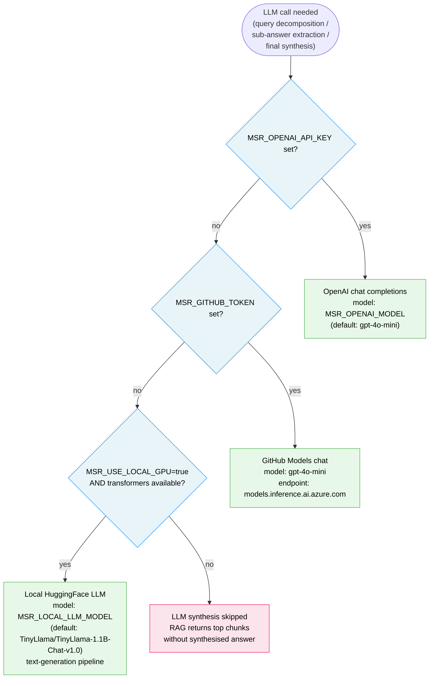
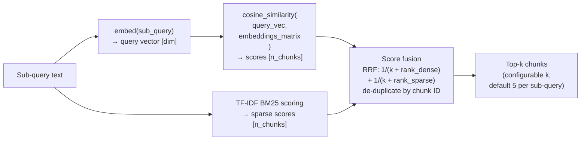

# Embedding Engines — Selection Logic and Characteristics

This diagram details the four embedding engines available in the RAG
pipeline and how the system selects between them at startup.

---

## Selection flowchart

```mermaid
flowchart TD
    START(["MSRDigitalTwinRAG.__init__()\n_build_embed_fn()"])

    C_OAI{"MSR_OPENAI_API_KEY\nset and non-empty?"}
    C_GH{"MSR_GITHUB_TOKEN\nset and non-empty?\n(and no OpenAI key)"}
    C_GPU{"MSR_USE_LOCAL_GPU\n= 'true'?\n(and no API keys)"}
    C_NP{"numpy available?"}

    E_OAI["OpenAI-compatible API\nendpoint: MSR_OPENAI_BASE_URL\n(default: api.openai.com/v1)\nmodel: MSR_EMBED_MODEL\n(default: text-embedding-3-small)\ndim: 1536\ncost: API call per batch"]

    E_GH["GitHub Models API\nendpoint: models.inference.ai.azure.com\nmodel: text-embedding-3-small\ndim: 1536\ncost: free with Copilot Pro\n(uses MSR_GITHUB_TOKEN)"]

    E_GPU["Local GPU — sentence-transformers\nmodel: MSR_LOCAL_EMBED_MODEL\n(default: all-MiniLM-L6-v2)\ndim: 384\ncost: zero (local compute)\nrequires: torch + sentence-transformers\ncache: MSR_HF_CACHE_DIR\n(default /tmp/hf_cache)"]

    E_RP["Random projection (numpy)\ndim: 256\nProjection matrix: seeded PRNG\n_VOCAB_SIZE=16384 hash features\nzero external dependencies\nconsistent across restarts\nfor same numpy seed"]

    WARN["⚠️ Warning logged:\n'No embedding key found,\nfalling back to random projection'"]

    C_OAI -->|yes| E_OAI
    C_OAI -->|no| C_GH
    C_GH  -->|yes| E_GH
    C_GH  -->|no| C_GPU
    C_GPU -->|yes| E_GPU
    C_GPU -->|no| C_NP
    C_NP  -->|yes| E_RP
    C_NP  -->|no (edge case)| WARN
    WARN  --> E_RP

    classDef engine fill:#fff8e1,stroke:#ff9800,color:#000
    classDef check  fill:#e8f4f8,stroke:#2196f3,color:#000
    classDef warn   fill:#fce4ec,stroke:#e91e63,color:#000
    class E_OAI,E_GH,E_GPU,E_RP engine
    class C_OAI,C_GH,C_GPU,C_NP check
    class WARN warn
```

---

## Engine comparison

| Engine | Trigger | Embedding dim | Semantic quality | External call | Cost |
|---|---|---|---|---|---|
| **OpenAI API** | `MSR_OPENAI_API_KEY` set | 1 536 | ★★★★★ | Yes (`api.openai.com`) | Per-token billing |
| **GitHub Models** | `MSR_GITHUB_TOKEN` set | 1 536 | ★★★★★ | Yes (`models.inference.ai.azure.com`) | Free w/ Copilot Pro |
| **Local GPU** | `MSR_USE_LOCAL_GPU=true` | 384 | ★★★★☆ | No (local inference) | Compute only |
| **Random projection** | Fallback (no keys) | 256 | ★★☆☆☆ | No (numpy only) | Zero |

> **Note:** Random-projection embeddings enable zero-dependency local
> operation and pass all unit tests, but semantic similarity quality is
> lower.  For production use, set `MSR_OPENAI_API_KEY` or
> `MSR_GITHUB_TOKEN`.

---

## LLM selection (parallel to embedding)



---

## Vector math internals (random-projection engine)

When no API keys are available the pipeline constructs embeddings using a
fixed random projection matrix seeded from numpy:

```
Input text
    → tokenise (lower-case alphanum tokens)
    → hash each token to [0, VOCAB_SIZE) = [0, 16384)
    → accumulate TF counts in a sparse VOCAB_SIZE vector
    → multiply by PRNG projection matrix [VOCAB_SIZE × 256]
    → L2-normalise result
    → 256-dimensional float32 embedding
```

Cosine similarity in the 256-dim space is used for retrieval.  The
projection matrix is re-seeded the same way each time so embeddings are
consistent across process restarts (same document always produces the
same vector as long as numpy random state is consistent).

---

## Hybrid retrieval (dense + sparse)


