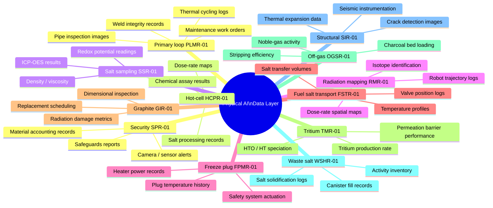

# Physical AI Integration — Architecture

This diagram shows how the MSR Data Layer feeds foundation-model training
for the 12 robotic operational areas of the
[MSR Physical AI Layer](https://github.com/pranavkantgaur/msr_physical_ai_layer).

---

## Three-stage training-data pipeline

```mermaid
flowchart TD
    subgraph ROBOTS["msr_physical_ai_layer — 12 Robotic Areas"]
        R1["PLMR-01\nPrimary loop\nmaintenance & repair"]
        R2["HCPR-01\nHot-cell chemical\nprocessing"]
        R3["SSR-01\nSalt sampling\n& analysis"]
        R4["RMR-01\nRadiation mapping\n& inspection"]
        R5["FPMR-01\nFreeze plug\nsafety monitoring"]
        R6["FSTR-01\nFuel salt transport\n& refilling"]
        R7["GIR-01\nGraphite moderator\ninspection"]
        R8["TMR-01\nTritium management\nsystems"]
        R9["OGSR-01\nOff-gas system\nhandling"]
        R10["WSHR-01\nWaste salt handling\n& solidification"]
        R11["SIR-01\nExternal structural\ninspection"]
        R12["SPR-01\nSecurity & safeguards\nmonitoring"]
    end

    subgraph STAGE1["Stage 1 — ORNL Archive Retrieval"]
        S1A["rag.load_msr_archive()\nIndexes all ORNL MSR reports"]
        S1B["rag.answer(design_query)\nRetrieves baselines for:\n• materials performance\n• operational procedures\n• maintenance strategies\n• safety limits"]
    end

    subgraph STAGE2["Stage 2 — Sensor Stream Ingestion"]
        S2A["PlantDataLoader\n.ingest_sensor_snapshot(rag, readings, source_id)"]
        S2B["PlantDataLoader\n.ingest_text(rag, text, source_id, data_type)"]
        S2C["Accumulated operational data:\n• sensor time-series\n• event logs\n• inspection records\n• maintenance reports"]
    end

    subgraph STAGE3["Stage 3 — Labelled Episode Export"]
        S3A["rag.answer(structured_query)\nExtracts labelled task examples\nfor each robotic area"]
        S3B["Training corpus\n./kb_store/ (accumulated)\n→ foundation model fine-tuning"]
    end

    ROBOTS -->|robotic task episodes\n(sensor + vision + action)| S2A & S2B
    S1A & S1B --> S2C
    S2A & S2B --> S2C
    S2C --> S3A --> S3B

    subgraph UC["use_cases/physical_ai/ — Documentation"]
        UC1["01_primary_loop_maintenance_repair.md"]
        UC2["02_hot_cell_chemical_processing.md"]
        UC3["03_salt_sampling_analysis.md"]
        UC4["04_radiation_mapping_inspection.md"]
        UC5["05_freeze_plug_safety_monitoring.md"]
        UC6["06_fuel_salt_transport_refilling.md"]
        UC7["07_graphite_moderator_inspection.md"]
        UC8["08_tritium_management.md"]
        UC9["09_off_gas_system_handling.md"]
        UC10["10_waste_salt_handling_solidification.md"]
        UC11["11_external_structural_inspection.md"]
        UC12["12_security_safeguards_monitoring.md"]
    end

    R1 -.-> UC1
    R2 -.-> UC2
    R3 -.-> UC3
    R4 -.-> UC4
    R5 -.-> UC5
    R6 -.-> UC6
    R7 -.-> UC7
    R8 -.-> UC8
    R9 -.-> UC9
    R10 -.-> UC10
    R11 -.-> UC11
    R12 -.-> UC12

    classDef robot fill:#e0f2f1,stroke:#009688,color:#000
    classDef stage fill:#fff8e1,stroke:#ff9800,color:#000
    classDef uc    fill:#f3e5f5,stroke:#9c27b0,color:#000
    class R1,R2,R3,R4,R5,R6,R7,R8,R9,R10,R11,R12 robot
    class STAGE1,STAGE2,STAGE3 stage
    class UC1,UC2,UC3,UC4,UC5,UC6,UC7,UC8,UC9,UC10,UC11,UC12 uc
```

---

## Data types ingested per robotic area



---

## API usage pattern (per robotic area use case)

Each use-case file in `use_cases/physical_ai/` follows the same three-step
pattern.  Example for PLMR-01 (Primary Loop Maintenance & Repair):

```python
from msr_digital_twin_with_rag import MSRDigitalTwinRAG
from msr_kb_sources import PlantDataLoader

rag = MSRDigitalTwinRAG()

# ── Stage 1: retrieve ORNL maintenance baselines ────────────────────────────
rag.load_msr_archive()
baseline = rag.answer(
    "What weld inspection and repair procedures were used in the MSRE "
    "primary circuit? What defect types were found and how were they remediated?"
)

# ── Stage 2: ingest robot task episode ─────────────────────────────────────
loader = PlantDataLoader()
loader.ingest_text(
    rag,
    text=(
        "PLMR-01 inspection episode 2025-01-15T10:22Z. "
        "Location: primary loop elbow PL-E-03. "
        "Visual: hairline crack detected at 45° orientation, "
        "estimated depth 0.3 mm by ultrasonic probe. "
        "Weld repair performed: TIG, filler INCO-82, post-weld heat treatment 871°C/1h. "
        "Post-repair: no indications in PT or UT. "
        "Return to service: 2025-01-15T18:45Z."
    ),
    source_id="plmr-01/episode/2025-01-15T10:22Z",
    data_type="maintenance_report",
)

# ── Stage 3: export labelled training example ───────────────────────────────
labelled = rag.answer(
    "Given the ORNL weld repair procedures and the PLMR-01 episode record, "
    "produce a labelled training example: "
    "(observation: crack image + ultrasonic reading) → "
    "(action: repair procedure) → "
    "(outcome: post-repair acceptance criteria). "
    "Format as a JSON training record."
)
```
